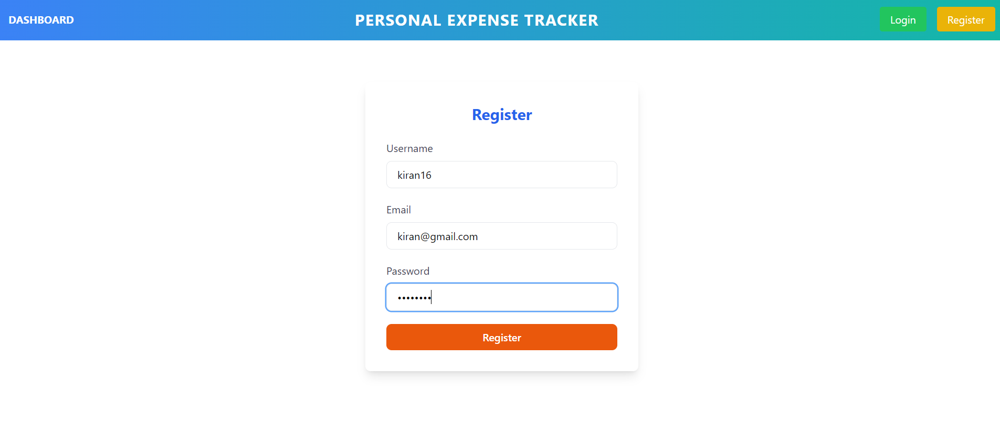
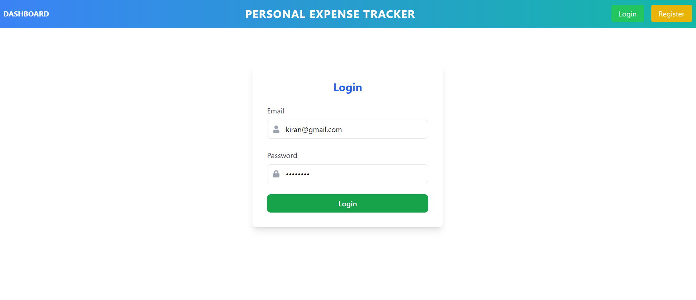
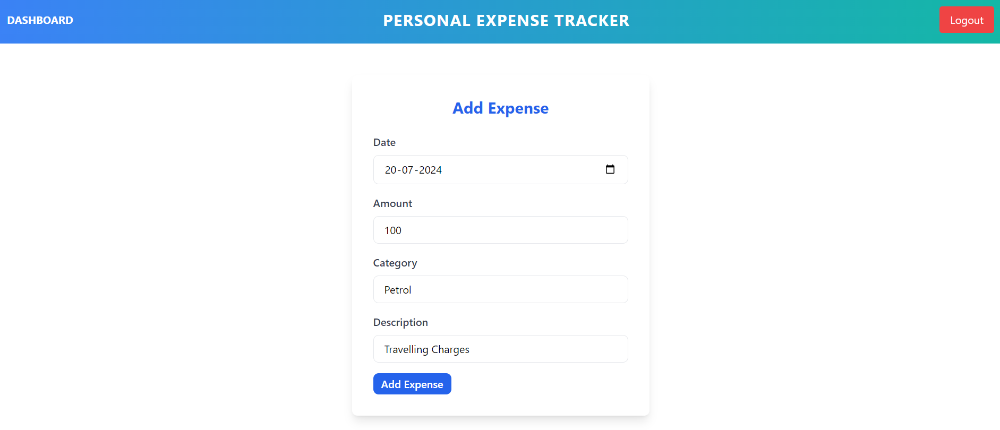

# Personal Expense Tracker

## Overview
This project is a personal expense tracker application that allows users to record their expenses, categorize them, and view summaries of their spending habits. The system manages user accounts, handles expense entries, and provides useful insights into the user's expenses.

## Features

### User Management
- User registration and login
- Secure session management

### Expense Management
- Add new expense entries with date, amount, category, and description
- View, edit, and delete expenses

### Category Management
- Default categories and custom categories

### Summary and Insights
- Total spending for a given time period (daily, weekly, monthly)
- Spending by category

## Tech Stack

- **Backend:** Node.js, Express, MongoDB
- **Frontend:** React, Vite, Tailwind CSS

### Sample Screenshots
- Registration

- Login


- Add Expenses


- Expenses List


## Project Structure

 ```bash
my-expense-tracker/
│
├── backend/
│   ├── config/
│   │   └── db.js
│   ├── controllers/
│   │   ├── authController.js
│   │   ├── categoryController.js
│   │   └── expenseController.js
│   ├── middleware/
│   │   └── authMiddleware.js
│   ├── models/
│   │   ├── Category.js
│   │   ├── Expense.js
│   │   └── User.js
│   ├── routes/
│   │   ├── auth.js
│   │   ├── categories.js
│   │   └── expenses.js
│   ├── .env
│   ├── package.json
│   ├── server.js
│   └── ...
│
├── frontend/
│   ├── src/
│   │   ├── components/
│   │   │   ├── ExpenseForm.jsx
│   │   │   ├── ExpenseList.jsx
│   │   │   ├── Header.jsx
│   │   │   └── ...
│   │   ├── contexts/
│   │   │   └── AuthContext.jsx
│   │   ├── pages/
│   │   │   ├── Dashboard.jsx
│   │   │   ├── Login.jsx
│   │   │   ├── Register.jsx
│   │   │   └── ...
│   │   ├── services/
│   │   │   ├── authService.js
│   │   │   ├── categoryService.js
│   │   │   ├── expenseService.js
│   │   │   └── ...
│   │   ├── App.jsx
│   │   ├── index.css
│   │   ├── main.jsx
│   │   └── ...
│   ├── .eslintrc.json
│   ├── index.html
│   ├── package.json
│   ├── postcss.config.js
│   ├── tailwind.config.js
│   └── vite.config.js
│
└── ...
  ```
## Getting Started

### Backend

1. **Clone the repository:**

    ```bash
    git clone <repository_url>
    cd my-expense-tracker/backend
    ```

2. **Install dependencies:**

    ```bash
    npm install
    ```

3. **Environment variables:**

    Create a `.env` file in the backend directory and add the following variables:

    ```makefile
    MONGO_URI=<your_mongodb_uri>
    JWT_SECRET=<your_jwt_secret>
    ```

4. **Start the server:**

    ```bash
    npm start
    ```

    The backend server should be running on [http://localhost:5000](http://localhost:5000).

### Frontend

1. **Navigate to the frontend directory:**

    ```bash
    cd ../frontend
    ```

2. **Install dependencies:**

    ```bash
    npm install
    ```

3. **Start the development server:**

    ```bash
    npm run dev
    ```

    The frontend should be running on [http://localhost:3000](http://localhost:3000).

### API Endpoints

#### Authentication

- **Register:**

    **Endpoint:** `POST /api/auth/register`

    **Input:**

    ```json
    {
      "email": "user@example.com",
      "password": "password"
    }
    ```

    **Output:**

    ```json
    {
      "token": "jwt_token"
    }
    ```

- **Login:**

    **Endpoint:** `POST /api/auth/login`

    **Input:**

    ```json
    {
      "email": "user@example.com",
      "password": "password"
    }
    ```

    **Output:**

    ```json
    {
      "token": "jwt_token"
    }
    ```

- **Logout:**

    **Endpoint:** `POST /api/auth/logout`

    **Output:**

    ```json
    {
      "message": "Logged out successfully"
    }
    ```

#### Expenses

- **Add Expense:**

    **Endpoint:** `POST /api/expenses`

    **Input:**

    ```json
    {
      "date": "2024-07-18",
      "amount": 50.0,
      "category": "Food",
      "description": "Lunch at restaurant"
    }
    ```

    **Output:**

    ```json
    {
      "_id": "expense_id",
      "date": "2024-07-18",
      "amount": 50.0,
      "category": "Food",
      "description": "Lunch at restaurant",
      "user": "user_id"
    }
    ```

- **Get Expenses:**

    **Endpoint:** `GET /api/expenses`

    **Output:**

    ```json
    [
      {
        "_id": "expense_id",
        "date": "2024-07-18",
        "amount": 50.0,
        "category": "Food",
        "description": "Lunch at restaurant",
        "user": "user_id"
      }
    ]
    ```

- **Update Expense:**

    **Endpoint:** `PUT /api/expenses/:id`

    **Input:**

    ```json
    {
      "date": "2024-07-18",
      "amount": 50.0,
      "category": "Food",
      "description": "Lunch at restaurant"
    }
    ```

    **Output:**

    ```json
    {
      "_id": "expense_id",
      "date": "2024-07-18",
      "amount": 50.0,
      "category": "Food",
      "description": "Lunch at restaurant",
      "user": "user_id"
    }
    ```

- **Delete Expense:**

    **Endpoint:** `DELETE /api/expenses/:id`

    **Output:**

    ```json
    {
      "message": "Expense deleted"
    }
    ```

#### Categories

- **Get Categories:**

    **Endpoint:** `GET /api/categories`

    **Output:**

    ```json
    [
      {
        "_id": "category_id",
        "name": "Food",
        "user": "user_id"
      }
    ]
    ```

### Running Tests

#### Backend Tests:
  - To run the backend tests, navigate to the backend directory and run:
  - npm test

### Deployment
- You can deploy the application to a cloud service like Heroku, Vercel, or Netlify. Make sure to set the appropriate environment variables in your deployment settings.

## Additional Notes
- Ensure MongoDB is running and accessible.
- Replace <repository_url> with your actual repository URL.
- Adjust any configurations as necessary for your environment.


You can save this text as `README.md` in your GitHub repository.
